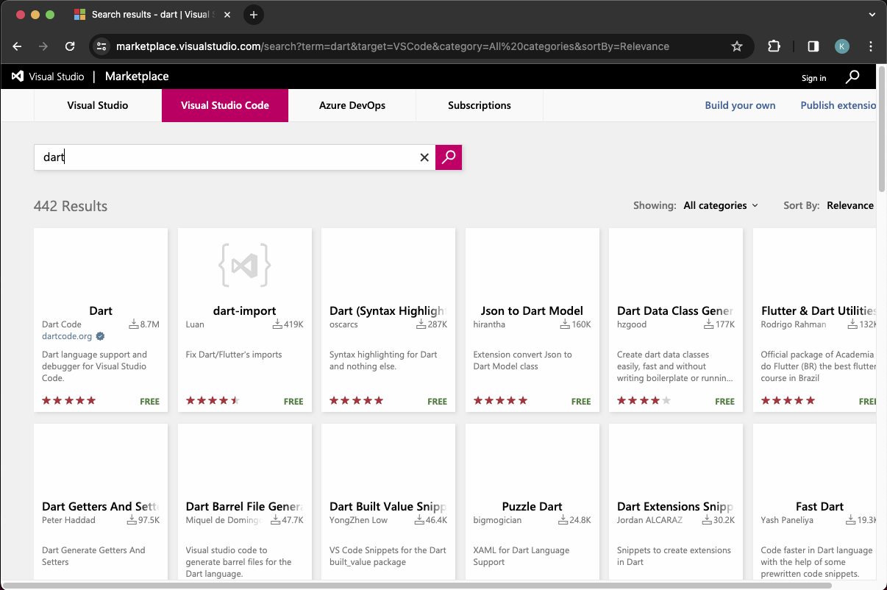
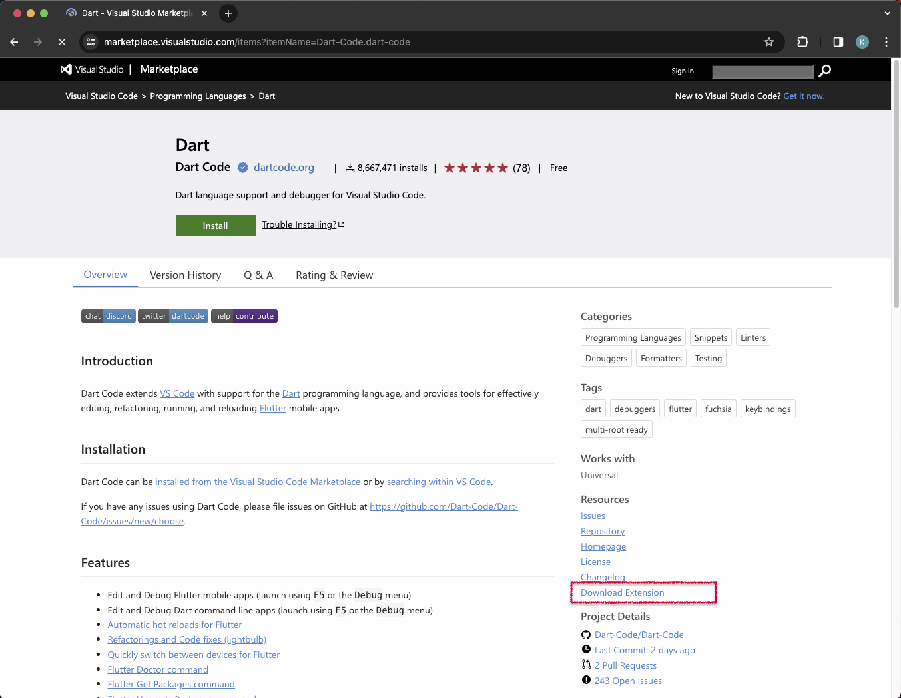

# VS Code How To Install Extensions

Visual Studio Code is a sophisticated piece of software that most people use to start their programming journey. Its robust features, cross-compatibility, the range of programming languages make it one of the most used programming tools in the world.

## How to Download Extensions for VS Code

If you need a VS Code extension for a device that isn’t connected to the internet, there is a workaround to accessing the extensions, however, you will need a second device with internet access. Here’s what you need to do:

- `1.` On the device with an active internet connection, open a browser of your choice and go to VS Code Marketplace’s URL.

        https://marketplace.visualstudio.com/vscode

    

- `2.` Click on the “Download Extension” button on the right side of the page. Don’t click on the “Install” button on the top, as it will begin to install the extension on the current device.

    

